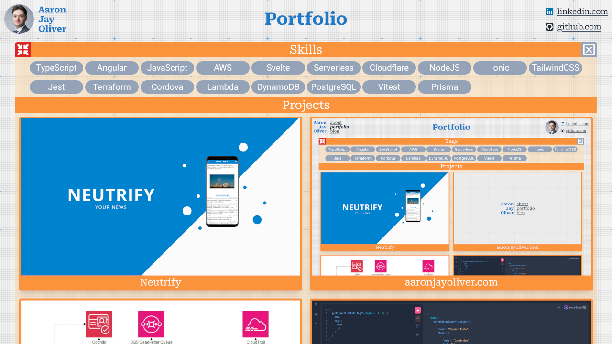

# Professional Portfolio Website

## Overview

Competition for software engineering jobs is intense, with hundreds of applicants chasing the same job. This explains the development of [aaronjayoliver.com](aaronjayoliver.com), a portfolio website that serves to advertise the author's web development skills. It aims to display evidence of the author's technical aptitude to potential employers, beyond the self-praise found in a CV.

## Live Demo

You can find the live portfolio here: [https://aaronjayoliver.com](https://aaronjayoliver.com.com)

## Features

- Tag based filtering of projects
- Lightning fast page loading
- Bold, yet functional design
- Provides links to external sites that further advertise the author

## Technologies

- HTML5, CSS3, TailwindCSS
- JavaScript, TypeScript
- Svelte 5, SvelteKit
- Cloudflare

The site is completely prerendered by SvelteKit, then deployed to Cloudflare. Given the small volumne of data required by this project, there is no need for a backend API integration, so all data is statically served by Cloudflare.
